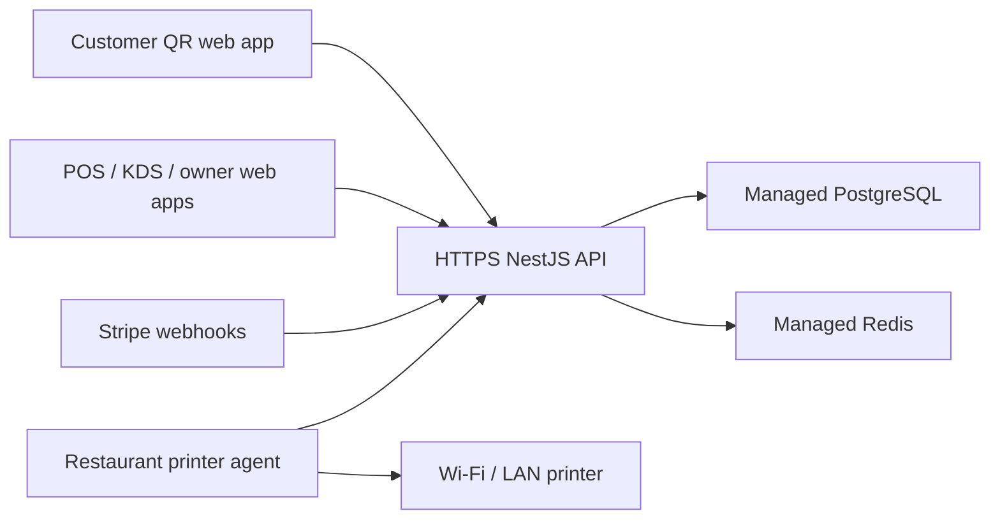

# Deployment Guide

## Recommended Hosting Model

Use one shared SaaS deployment for the first approximately ten restaurant
clients.



The browser applications can share one product domain:

- `order.example.com` for customer QR ordering.
- `app.example.com` for staff and owners.
- `api.example.com` for the backend.

Restaurant-specific domains can be added later, but they are unnecessary for
the initial client count. Tenant access is controlled by authenticated company
and outlet membership, not by domain.

## Required Services

- Container hosting for the API.
- Managed PostgreSQL with automated backups and point-in-time recovery.
- Managed Redis.
- DNS and managed HTTPS certificate.
- Secret manager.
- Central logs, error tracking, uptime checks, and alerts.

The API container is stateless. Run at least one instance for staging and two
instances for production once operational traffic matters. Socket.IO currently
uses process-local rooms; multiple API instances will require a Redis Socket.IO
adapter before horizontal scaling.

## Production Environment

Required:

```text
NODE_ENV=production
PORT=3001
API_CORS_ORIGINS=https://order.example.com,https://app.example.com
DATABASE_URL=postgresql://...
REDIS_URL=rediss://...
JWT_SECRET=<at least 32 random characters>
JWT_EXPIRES_IN_SECONDS=3600
PLATFORM_ADMIN_API_KEY=<at least 32 random characters>
OWNER_APP_BASE_URL=https://app.example.com
CUSTOMER_APP_BASE_URL=https://order.example.com
ONBOARDING_TOKEN_TTL_HOURS=72
STRIPE_SECRET_KEY=sk_...
STRIPE_WEBHOOK_SECRET=whsec_...
```

Do not set `STRIPE_API_HOST`, `STRIPE_API_PORT`, or `STRIPE_API_PROTOCOL` in
production. Those variables are only for the local Stripe stub.

Do not run the demo seed in production.

## Build

```powershell
docker build -f infra/Dockerfile.api -t restaurant-pos-api:<commit-sha> .
```

The image listens on port `3001` and starts:

```text
node apps/api/dist/main.js
```

The public health endpoint is:

```text
GET /api/v1/health
```

Treat `status: degraded` as unhealthy.

## Database Migrations

Run migrations as a one-off release job before switching application traffic:

```powershell
npm ci
npm run prisma:generate
npm run prisma:deploy
```

`prisma:deploy` uses `prisma migrate deploy` and is non-interactive. Do not use
`prisma migrate dev` in staging or production.

Before every production migration:

1. Take or verify a recent database backup.
2. Review the migration SQL.
3. Apply it to staging.
4. Run API and payment smoke tests.
5. Apply it once to production.
6. Deploy the matching application image.

## Stripe

Configure:

```text
https://api.example.com/api/v1/webhooks/stripe
```

Subscribe to:

- `checkout.session.completed`
- `checkout.session.async_payment_succeeded`
- `checkout.session.async_payment_failed`
- `checkout.session.expired`

Use separate Stripe test and live webhook endpoints and secrets. Confirm a real
test card payment and a real PayNow test before production approval. Browser
success redirects must never be used as proof of payment.

## Printer Agent

The API remains in the cloud. The printer agent runs on a restaurant Windows
computer that can:

- Reach the cloud API over HTTPS.
- Reach the printer's fixed local IP, normally on TCP port `9100`.
- Stay powered on during operating hours.

Configure:

```text
PRINTER_API_BASE_URL=https://api.example.com/api/v1
PRINTER_AGENT_ID=<assigned agent id>
PRINTER_AGENT_KEY=<one-time secret>
```

For production, package the agent as a supervised Windows service and verify
primary printer, retry, backup printer, and restart behavior.

## Deployment Order

1. Build an immutable image tagged with the Git commit SHA.
2. Run `npm run check`.
3. Apply migrations from a one-off release job.
4. Deploy the image.
5. Wait for `/api/v1/health`.
6. Verify login, QR resolution, and payment availability.
7. Run Stripe and printer smoke tests in staging.
8. Promote the same image to production.

## Current Production Gaps

Complete these before accepting live restaurant payments:

- Restrict Swagger or disable it in production.
- Add rate limiting to public, login, and platform endpoints.
- Authenticate Socket.IO connections and outlet-room joins.
- Add error tracking and structured log shipping.
- Add uptime, queue, failed-webhook, and failed-print alerts.
- Define backup retention and prove a restore.
- Configure secret rotation and least-privilege database credentials.
- Add a Redis Socket.IO adapter before running multiple API replicas.
- Complete real Stripe and physical printer acceptance tests.
