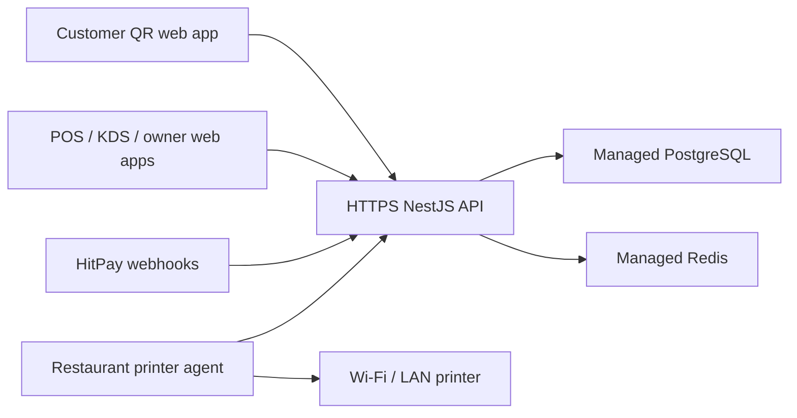

# Deployment Guide

## Recommended Hosting Model

Use one shared SaaS deployment for the first approximately ten restaurant
clients.



The browser applications can share one product domain:

- `order.example.com` for customer QR ordering.
- `app.example.com` for staff and owners.
- `api.example.com` for the backend.

Restaurant-specific domains can be added later, but they are unnecessary for
the initial client count. Tenant access is controlled by authenticated company
and outlet membership, not by domain.

For a concrete pre-production rollout sequence, see
[docs/runbooks/staging-rollout.md](docs/runbooks/staging-rollout.md).

## Required Services

- Container hosting for the API and customer web.
- A one-off container job for database migrations.
- Managed PostgreSQL with automated backups and point-in-time recovery.
- Managed Redis.
- DNS and managed HTTPS certificate.
- Secret manager.
- Central logs, error tracking, uptime checks, and alerts.

The API container is stateless. Run at least one instance for staging and two
instances for production once operational traffic matters. Socket.IO currently
uses process-local rooms; multiple API instances will require a Redis Socket.IO
adapter before horizontal scaling.

## Repository Deployment Contract

Configure three services from the same GitHub repository:

| Service            | Dockerfile                      | Port   | Health check     |
| ------------------ | ------------------------------- | ------ | ---------------- |
| API                | `infra/Dockerfile.api`          | `3001` | `/api/v1/health` |
| Customer web       | `infra/Dockerfile.customer-web` | `3000` | `/`              |
| Database migration | `infra/Dockerfile.migrate`      | none   | one-off job      |

The API health endpoint returns HTTP `503` when PostgreSQL or Redis is
unavailable. Configure the platform to use the HTTP status code rather than
checking only that the container process is running.

For the first deployment, run one API replica. Add the Redis Socket.IO adapter
before scaling the API horizontally.

## Production Environment

Required:

```text
NODE_ENV=production
PORT=3001
API_CORS_ORIGINS=https://order.example.com,https://app.example.com
DATABASE_URL=postgresql://...
REDIS_URL=rediss://...
JWT_SECRET=<at least 32 random characters>
JWT_EXPIRES_IN_SECONDS=3600
PLATFORM_ADMIN_API_KEY=<at least 32 random characters>
OWNER_APP_BASE_URL=https://app.example.com
CUSTOMER_APP_BASE_URL=https://order.example.com
ONBOARDING_TOKEN_TTL_HOURS=72
HITPAY_API_KEY=<hitpay business api key>
HITPAY_WEBHOOK_SALT=<hitpay webhook salt>
HITPAY_API_URL=https://api.sandbox.hit-pay.com
```

Customer web image build argument:

```text
NEXT_PUBLIC_API_BASE_URL=https://api.example.com/api/v1
```

This is embedded into the browser bundle at build time. Build separate staging
and production customer images when those environments use different API
domains.

Do not run the demo seed in production.

## Build

You can either run the three Docker builds manually or use the helper script
at `scripts/build-release-images.ps1`.

```powershell
docker build -f infra/Dockerfile.api -t restaurant-pos-api:<commit-sha> .
docker build -f infra/Dockerfile.migrate -t restaurant-pos-migrate:<commit-sha> .
docker build `
  -f infra/Dockerfile.customer-web `
  --build-arg NEXT_PUBLIC_API_BASE_URL=https://api.example.com/api/v1 `
  -t restaurant-pos-customer-web:<commit-sha> .
```

The API image listens on port `3001` and starts:

```text
node apps/api/dist/main.js
```

The public health endpoint is:

```text
GET /api/v1/health
```

Treat `status: degraded` as unhealthy.

The customer web image listens on port `3000` and starts its standalone
Next.js server. Configure the hosting platform to expose it at
`https://order.example.com`. A plain `GET /` can be used as its container
health check; real acceptance testing should also open a valid QR URL.

## Database Migrations

Run the migration image as a one-off release job before switching application
traffic:

```powershell
docker run --rm `
  -e DATABASE_URL=postgresql://... `
  restaurant-pos-migrate:<commit-sha>
```

`prisma:deploy` uses `prisma migrate deploy` and is non-interactive. Do not use
`prisma migrate dev` in staging or production.

Most container platforms provide a release command, pre-deploy job, or
one-off task. Point that facility at the migration image. Do not run migrations
concurrently from every API replica.

Before every production migration:

1. Take or verify a recent database backup.
2. Review the migration SQL.
3. Apply it to staging.
4. Run API and payment tests.
5. Apply it once to production.
6. Deploy the matching application image.

## HitPay

Configure:

```text
https://api.example.com/api/v1/webhooks/hitpay
```

Use separate HitPay sandbox and live webhook configurations. Confirm a real
sandbox card or wallet payment before production approval. Browser success
redirects still must never be used as proof of payment on their own.

## Printer Agent

The API remains in the cloud. The printer agent runs on a restaurant Windows
computer that can:

- Reach the cloud API over HTTPS.
- Reach the printer's fixed local IP, normally on TCP port `9100`.
- Stay powered on during operating hours.

Configure:

```text
PRINTER_API_BASE_URL=https://api.example.com/api/v1
PRINTER_AGENT_ID=<assigned agent id>
PRINTER_AGENT_KEY=<one-time secret>
```

For production, package the agent as a supervised Windows service and verify
primary printer, retry, backup printer, and restart behavior.

## Deployment Order

1. Build immutable API, migration, and customer web images tagged with the Git
   commit SHA.
2. Run `npm run check`.
3. Apply migrations once using the migration image.
4. Deploy the API image.
5. Wait for `/api/v1/health`.
6. Deploy the customer web image with the matching API base URL.
7. Verify login, QR resolution, menu loading, and payment availability.
8. Run HitPay sandbox and printer smoke tests in staging.
9. Promote the same images to production.

## CI Deployment Proof

GitHub Actions verifies the deployment contract on every push and pull request:

1. Runs formatting, schema validation, typechecks, lint, tests, and production
   builds.
2. Builds all three Docker images.
3. Starts clean PostgreSQL and Redis services.
4. Applies all migrations through the migration image.
5. Starts the production API image and requires a successful HTTP health check.

## Current Production Gaps

Complete these before accepting live restaurant payments:

- Restrict Swagger or disable it in production.
- Add rate limiting to public, login, and platform endpoints.
- Authenticate Socket.IO connections and outlet-room joins.
- Add error tracking and structured log shipping.
- Add uptime, queue, failed-webhook, and failed-print alerts.
- Define backup retention and prove a restore.
- Configure secret rotation and least-privilege database credentials.
- Add a Redis Socket.IO adapter before running multiple API replicas.
- Complete real HitPay sandbox and physical printer acceptance tests.
